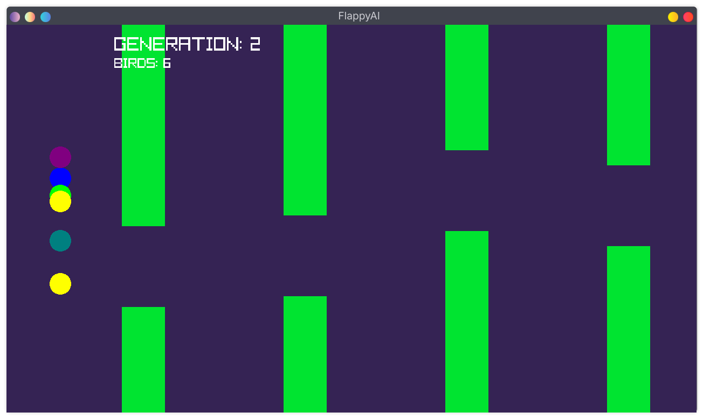

# FlappyAI
Flappy bird AI agents that evolves using genetic mutation and neural network

### Project status: Finished

## About how this is works
I am using a custom made neural network ([network.py](network.py)) using nothing but numpy to feed the input, and get the output via doing calculations of weights and biases

The agents don't actually learn but the whole population adapts by a process which is similar to natural selection
or survival of the fittest. Meaning in each generation the agnet which has survived the longest gets the chance 
to reproduce (technically mutate) and give more of similar agents for the next generation. This process keeps happening
until and unless an agent (agents) come with the network that can play the game forever and then since it can't die
the generation freezes there for now.

For drawing the game, I am using raylib using pyray pip package

## Conclusion
When the agents were fed these inputs
- their y coordinate
- their y velocity
- distance from the next closest pillar
- gap center of the pillar

the agents learned to play this game very quickly sometimes even without evolving if they start with enough population like 1000

With population size of 100-500 the agents learned to play the game within 5 generations

## Next step
I would like to tweak the difficulty of the game to make it harder for the agents to learn.

## Screenshot of agents learning

